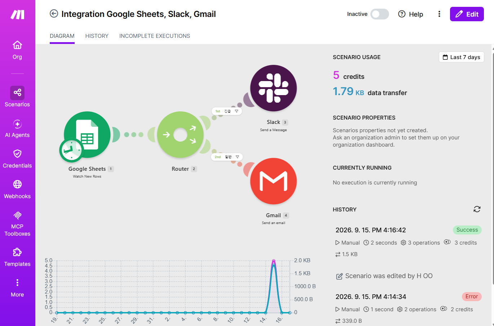
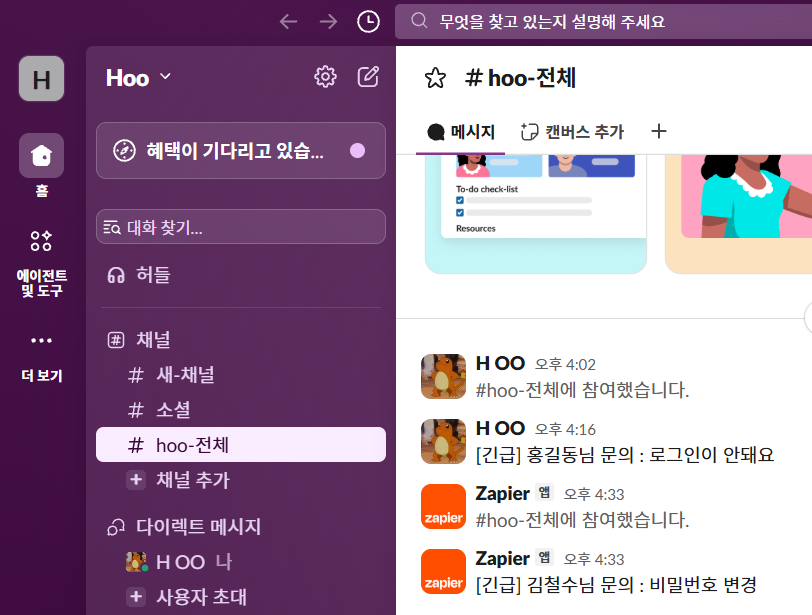
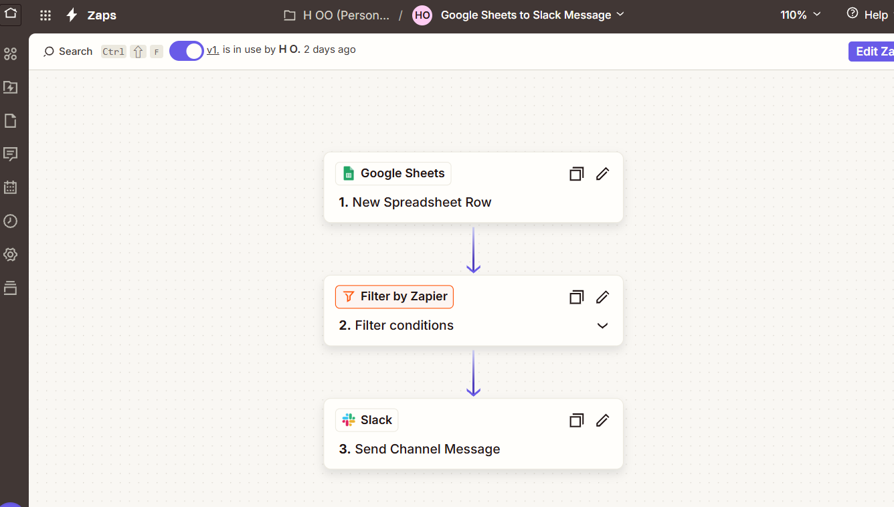
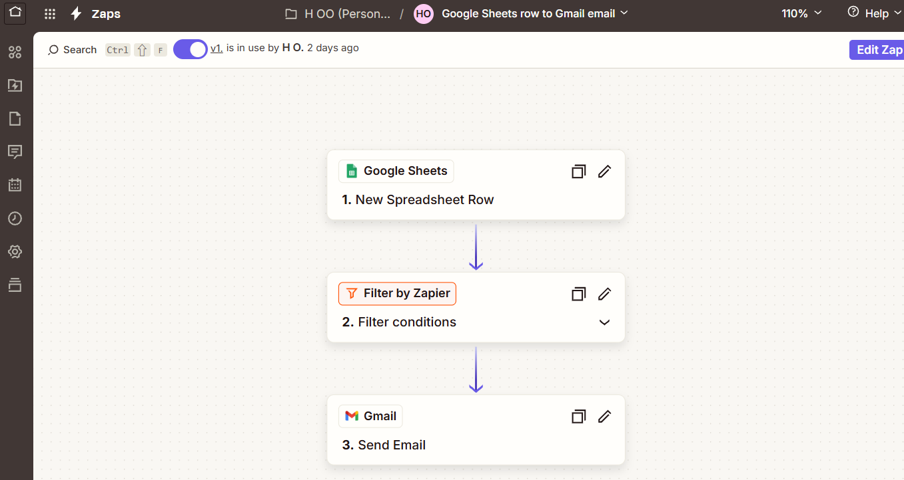

# [프로젝트 1] 자동화 도구 비교 구현 보고서

## 0. 핵심 개념: Trigger와 Action

- **Trigger(트리거)**: 워크플로우를 시작시키는 이벤트. 사람이 직접 실행하지 않아도, 정해진 조건(새 데이터 발생, 정해진 시각 도달 등)이 감지되면 자동으로 다음 단계를 실행시키는 "시작점" 역할을 한다.
- **Action(액션)**: Trigger 이후에 실제로 데이터를 처리하거나 외부 서비스에 작업을 수행시키는 "처리 동작". 하나의 워크플로우 안에 여러 개의 Action을 순차적으로 연결할 수 있다.

**이번 프로젝트에서의 예시**

| 구분 | Make | Zapier |
|---|---|---|
| Trigger | Google Sheets – Watch New Rows (시트에 새 행이 추가되는 순간 감지) | Google Sheets – New Spreadsheet Row (동일한 이벤트를 감지) |
| Action | Slack – Create a Message / Gmail – Send an Email (감지된 데이터를 바탕으로 실제 알림을 전송) | Slack – Send Channel Message / Gmail – Send Email |

즉, "새 행이 추가된다"는 사건 자체는 Trigger이고, 그 사건이 발생했을 때 "Slack에 메시지를 보낸다"거나 "메일을 발송한다"는 것은 Action이다. 두 도구 모두 이 Trigger→Action 구조는 동일하지만, 조건 분기(Router/Filter)를 그 사이에 끼워 넣는 방식에서 차이가 발생한다 (Make는 하나의 시나리오 안에서 Router로 분기하지만, Zapier 무료 플랜은 Filter만 지원해 워크플로우를 두 개로 쪼개야 한다).

## 1. 워크플로우 개요

**시나리오:** 문의 접수 시트에 새 행이 추가되면, 긴급도에 따라 분기하여
- 긴급도 = 높음 → Slack 알림
- 긴급도 = 낮음 → Gmail 알림

**구성 요소**
| 구성 요소 | 내용 |
|---|---|
| Trigger | Google Sheets 새 행 추가 |
| 조건 분기 | 긴급도 컬럼 값 (높음 / 낮음) |
| Action 1 | Slack 메시지 전송 |
| Action 2 | Gmail 이메일 전송 |

---

## 2. [Make 구현]

- **Trigger:** Google Sheets – Watch New Rows
- **Router:** 긴급도 = 높음 / 긴급도 = 낮음 두 경로로 분기
- **Action 1 (경로1):** Slack – Create a Message
- **Action 2 (경로2):** Gmail – Send an Email

### 구성 화면 캡처

### 실행 결과 캡처
Slack 도착 화면 (긴급 경로):

Gmail 도착 화면 (일반 경로):

---

## 3. [Zapier 구현]

- **Trigger:** Google Sheets – New Spreadsheet Row
- **분기 방식:** 무료 플랜 기준 Filter로 두 개의 Zap으로 분리
  - Zap A: Filter(긴급도=높음) → Slack – Send Channel Message
  - Zap B: Filter(긴급도=낮음) → Gmail – Send Email

### 구성 화면 캡처
Zap A (긴급 → Slack):

Zap B (일반 → Gmail):

### 실행 결과 캡처
Slack 도착 화면 (긴급 경로):

Gmail 도착 화면 (일반 경로):

---

## 4. 도구별 비교

| 비교 항목 | Make | Zapier |
|---|---|---|
| UI/UX | 시각적 노드(플로우차트) 기반, 전체 흐름을 한눈에 파악 가능 | 리스트/카드 기반, 단계별로 순차 진행 |
| 설정 난이도 | 초반 학습 곡선 있음 (모듈/라우터 개념 익혀야 함) | 직관적이고 진입장벽 낮음 |
| 연동 서비스 범위 | 광범위 (1,700개 이상), 세부 옵션 조정 자유도 높음 | 광범위 (6,000개 이상 앱), 대신 세부 커스터마이징은 제한적 |
| 무료 플랜 범위 | 월 1,000 Ops, 시나리오 내 Router 무료 사용 가능 | 월 100 Tasks, Paths(분기)는 유료 플랜 필요 → Filter+Zap 분리로 대체 |
| 실행 로그 확인 방식 | 시나리오 실행 히스토리에서 각 모듈 입출력 데이터까지 상세 확인 | Zap History에서 Task별 성공/실패 여부와 데이터 확인 |

### 장단점 정리

**Make**
- 장점: 하나의 시나리오 안에서 복잡한 분기/멀티 경로를 시각적으로 설계 가능, 무료 플랜에서도 분기 기능 제공
- 단점: 초기 UI가 다소 낯설고 학습 시간이 필요함

**Zapier**
- 장점: 앱 연동 수가 많고 설정이 직관적이라 빠르게 시작 가능
- 단점: 무료 플랜에서는 분기(Paths)를 못 써서 Zap을 여러 개로 쪼개야 하는 번거로움 있음

### 적합한 상황

- **Make가 적합한 경우:** 하나의 워크플로우 안에 여러 조건 분기와 복잡한 데이터 가공이 필요한 경우
- **Zapier가 적합한 경우:** 단순한 1:1 연동 자동화를 빠르게 구축하고 싶은 경우, 이미 특정 니치 앱과의 연동이 필요한 경우

---

## 5. 보안 처리 확인
- [ ] 캡처 이미지 내 이메일 주소 일부 마스킹 완료
- [ ] API Key / 토큰 노출 여부 확인 완료
