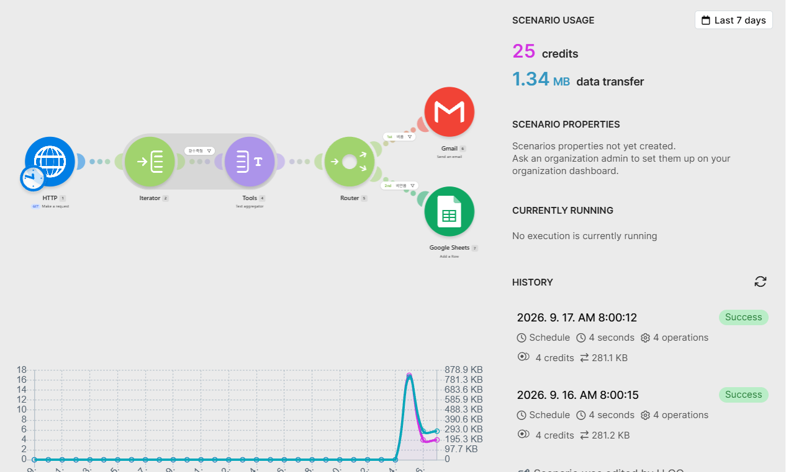
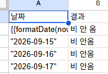
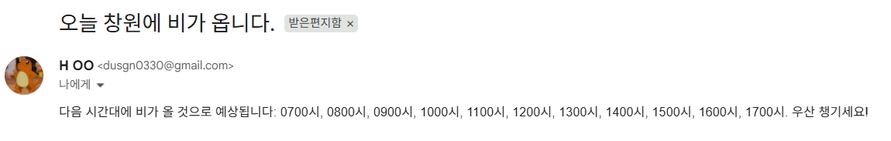

# 프로젝트 2: 창원 날씨 조건부 알림 자동화

매일 아침 창원 지역 날씨를 직접 확인하는 대신, **비가 올 것으로 예상되는 시간대가 있을 때만**
자동으로 이메일 알림을 받고, 그렇지 않은 날은 기록만 남기는 자동화 워크플로우입니다.

## 1. 반복 업무 정의

매일 아침 창원 지역 강수 여부를 직접 확인하는 반복 작업을, 비가 예상되는 날에만
자동으로 이메일 알림을 받도록 자동화한다. 비가 오지 않는 날은 알림 없이 기록만 남긴다.

## 2. 도구 선정 및 이유

**선정 도구: Make**

- HTTP 모듈로 외부 공공 API를 자유롭게 호출 가능
- Scheduler, Router, Iterator, Aggregator 등 조건/배열 처리 기능이 무료 플랜 안에서 사용 가능
- 프로젝트 1에서 사용 경험이 있어 설정과 디버깅에 익숙함

## 3. 데이터 출처

**기상청 단기예보 조회서비스 (공공데이터포털, data.go.kr)**

- 최초에는 회원가입 없이 쓸 수 있는 Open-Meteo(글로벌 모델 기반) API로 설계했으나,
  네이버/기상청 예보와 비교했을 때 국내 지역 정확도 차이가 있어 **대한민국 기상청(KMA) 공식 API로 변경**함
- 요청 좌표: nx=91, ny=77 (창원시 의창구/성산구 일대, 창원대학교 인근과 동일 격자)
- API Endpoint: `getVilageFcst` (동네예보 조회)
- ⚠️ 인증키(ServiceKey)는 보안을 위해 캡처 시 마스킹 처리함

## 4. 워크플로우 흐름

```
[Scheduler: 매일 오전 8시 실행]
        ↓
[HTTP: 기상청 API 호출 → 창원 단기예보 전체 데이터 수신]
        ↓
[Iterator: 응답 배열(item[])을 항목별로 하나씩 분해]
        ↓
[Filter: category=POP(강수확률) AND 오늘 날짜 AND 확률≥50%인 항목만 통과]
        ↓
[Text Aggregator: 조건을 통과한 시간대(fcstTime)들을 하나의 문자열로 결합]
        ↓
      [Router]
     /                          \
텍스트가 비어있지 않음(비 옴)      텍스트가 비어있음(비 안 옴)
        ↓                              ↓
 [Gmail: 예상 시간대와 함께      [Google Sheets: 날짜와
  우산 알림 메일 발송]             "비 안옴" 결과 기록]
```

| 단계 | 구성 요소 | 설명 |
|---|---|---|
| 1 | Trigger | Scheduler – 매일 오전 8시 실행 |
| 2 | Action 1 | HTTP 모듈 – 기상청 단기예보 API 호출 |
| 3 | Action 2 | Iterator – 응답 배열을 항목 단위로 분해 |
| 4 | 조건 필터 | category=POP, 오늘 날짜, 확률≥50% |
| 5 | Action 3 | Text Aggregator – 조건에 맞는 시간대를 문자열로 결합 |
| 6 | 조건 분기 | Router – 결합된 텍스트가 비어있는지 여부로 분기 |
| 7 | Action 4-A | 비 옴 → Gmail 알림 메일 발송 |
| 7 | Action 4-B | 비 안 옴 → Google Sheets 기록 |

> 강수확률 최댓값 하나만으로 판단하면 "오전 9시와 오후 6시에만 비가 오는 날"을
> "오전 9시부터 오후 6시까지 계속 비가 온다"고 잘못 해석할 위험이 있어,
> 최댓값 대신 조건을 만족하는 **시간대 목록을 그대로 나열**하는 방식으로 설계를 변경함.

## 5. 실제 실행 결과

### 전체 구조 및 자동 실행 이력 (Schedule 기반, 사람 개입 없이 매일 자동 실행됨)


위 History에서 2026.9.16, 2026.9.17 모두 사람의 개입 없이 `Schedule`에 의해 자동 실행되어
`Success`로 완료된 것을 확인할 수 있다.

### 비 안 옴 경로 실행 결과
Google Sheets에 날짜와 결과가 자동으로 기록된 모습:


### 비 옴 경로 실행 결과
2026년 9월 18일 실제로 창원에 비가 온 날, 시스템이 이를 정확히 예측하여 Gmail로 자동 알림을 발송한 결과:


메일 본문에 "0700시, 0800시, 0900시, 1000시, 1100시, 1200시, 1300시, 1400시, 1500시, 1600시, 1700시"처럼 강수확률 50% 이상인 시간대가 그대로 나열되어, 실제 체감(하루 종일 비)과도 일치하는 정확한 결과를 확인했다. 이로써 비 옴/비 안 옴 두 분기 경로가 모두 실제로 1회 이상 실행된 것을 증명한다.

## 6. 모니터링 및 재시도 전략

**현재 적용된 모니터링**
- Make의 **Scenario History**를 통해 매일 자동 실행 결과(Success/Error)를 확인하고 있음 (5절 캡처 참고)
- 실행 중 오류가 발생하면 Make가 자동으로 해당 실행을 "Error" 상태로 표시하고, 오류 원인(예: `channel_not_found`, `InvalidConfigurationError` 등)을 상세히 기록해줌 — 실제 개발 과정에서 Slack 채널 오류를 이 로그로 진단하고 해결한 이력이 있음

**향후 보완 계획 (재시도 및 대체경로 설계)**

| 항목 | 설계 내용 |
|---|---|
| 실패 알림 | HTTP 모듈(기상청 API 호출)에 Make의 **"Add error handler"** 기능을 연결해, 오류 발생 시 즉시 관리자 Gmail로 "워크플로우 실패" 알림 메일을 자동 발송 |
| 재시도 정책 | Error handler 안에 **"Resume"** 또는 **"Break"** 모듈을 사용해, API 호출 실패 시 1분 간격으로 최대 3회까지 자동 재시도 → 그래도 실패하면 실패 알림으로 전환 |
| 대체 경로 | 기상청 API가 3회 재시도 후에도 응답하지 않을 경우, 백업으로 Open-Meteo API(키 불필요)를 호출하는 대체 경로를 Router에 추가 → 기록 자체가 완전히 누락되는 것을 방지 |
| 데이터 유실 방지 | Google Sheets 기록(Action 4-B)이 실패할 경우를 대비해, 같은 데이터를 임시로 Make의 **Data Store**(내장 키-값 저장소)에도 백업 저장 |

이 전략은 보너스 과제(실패 알림 및 재시도)로 설계까지 마쳤으며, 실제 API 장애가 아직 발생하지 않아 구현 및 실행 캡처는 다음 단계로 남겨두었다.

## 7. 모듈화 전략 및 확장성

현재는 하나의 시나리오 안에 HTTP → Iterator → Filter → Text Aggregator → Router → Gmail/Sheets가 전부 연결되어 있다. 워크플로우가 더 복잡해지거나 다른 지역으로 확장할 경우를 대비한 모듈화 계획은 다음과 같다.

- **서브 시나리오 분리**: "날씨 데이터 조회 및 강수 시간대 판별" 부분(HTTP~Text Aggregator)과 "알림 발송" 부분(Router~Gmail/Sheets)을 각각 별도의 시나리오로 분리하고, Make의 **Webhook**으로 두 시나리오를 연결한다. 이렇게 하면 알림 방식(Gmail→Slack 등)만 바꾸고 싶을 때 데이터 조회 로직을 건드릴 필요가 없다.
- **파라미터화**: 지금은 nx=91, ny=77이 하드코딩되어 있는데, 이를 Make의 **Data Store**나 Google Sheets의 "지역 목록" 시트에서 읽어오도록 바꾸면, 창원뿐 아니라 여러 지역을 같은 시나리오 하나로 순회하며 처리할 수 있다 (지역별로 시나리오를 복제할 필요가 없어짐).
- **재사용 사례**: 프로젝트 1에서 만든 "Slack 알림 Action" 패턴과 "Gmail 알림 Action" 패턴을 템플릿처럼 재사용해, 이번 프로젝트의 알림 부분을 빠르게 구성할 수 있었다. 이후 다른 자동화(예: 미세먼지 알림, 온도 알림)를 만들 때도 같은 Action 템플릿을 복제해 트리거 조건만 바꾸는 방식으로 확장 가능하다.

## 8. 노코드 도구의 한계와 코드 기반 확장 계획

**실제로 겪은 노코드 한계**
- 기상청 API 응답은 약 900개 이상의 항목이 뒤섞인 배열로 오는데, 이 중 원하는 조건(category=POP, 오늘 날짜, 확률≥50%)만 골라내려면 **Iterator + Filter + Text Aggregator**라는 3개의 모듈을 추가로 연결해야 했다. 코드 기반이었다면 `array.filter(...).map(...)` 한두 줄로 끝났을 작업이다.
- Iterator는 배열 항목 수만큼 **Operation(작업 실행 횟수)을 소모**한다. 지금은 무료 플랜(월 1,000 Ops) 안에서 문제없지만, 배열 크기가 더 크거나 실행 빈도가 늘어나면 무료 한도를 빠르게 초과할 수 있다는 한계가 있다.
- 날짜 형식 변환(`formatDate` 함수), 문자열 앞뒤 따옴표 문법처럼 사소한 문법 오류를 시각적 UI에서 디버깅하는 데 코드 환경보다 시간이 더 걸렸다.

**코드 기반으로 확장한다면**
- Make의 **"Custom code" / Webhook + 서버리스 함수(Google Apps Script, AWS Lambda 등)**를 중간에 하나 추가해, "API 응답을 받아서 오늘의 강수 시간대 목록만 뽑아 반환"하는 로직을 JavaScript 함수 한 번 호출로 대체하면, Iterator/Filter/Aggregator 3개 모듈을 없애고 Operation 소모량도 크게 줄일 수 있다.
- 장기적으로는 Make 자체를 Trigger(스케줄)로만 쓰고, 데이터 가공과 판별 로직은 전부 별도의 경량 서버리스 함수로 옮겨서 "노코드는 트리거·알림 담당, 코드가 로직 담당"으로 역할을 나누는 하이브리드 구조로 발전시킬 계획이다.

## 9. 보안 처리 확인
- [x] API 인증키(ServiceKey) 마스킹 처리
- [x] 이메일 주소 일부 마스킹 처리
